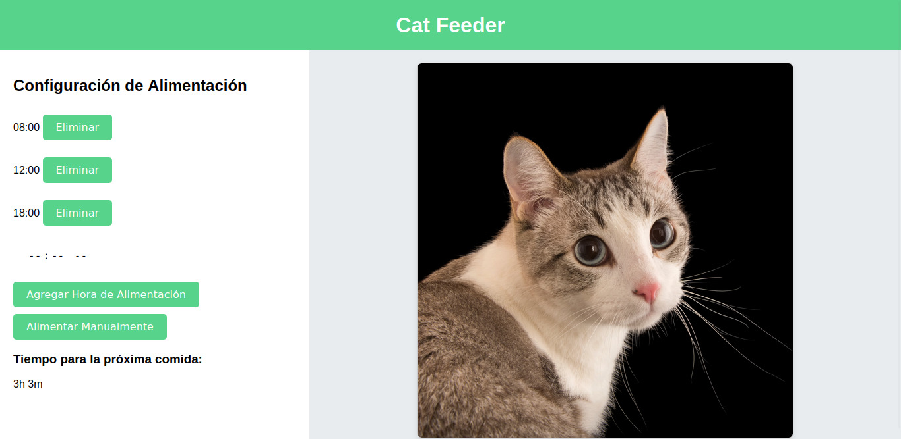

# Implementation of an Automatic Cat Feeder Based on Artificial Vision Using Raspberry Pi and Arduino

## Project Summary

This project describes the development and implementation of an automatic cat feeder based on an artificial vision system. The system can be activated in two ways: automatically and manually, and is designed to improve pet feeding using modern technologies such as Raspberry Pi and Arduino.

## System Functionality Description

### Automatic Mode

1. _Cat Detection:_ The system uses a webcam connected to the Raspberry Pi to capture images of the environment every second. These images are processed to detect the presence of a cat with confidence greater than 50%.
2. _Feeding Interval Verification:_ In addition to detecting the cat, the system verifies the activation of the token corresponding to the established feeding interval.
3. _Feeder Activation:_ If both conditions are met, the system sends a signal through a serial connection from the computer to an Arduino. This Arduino controls a servomotor that rotates 45° for 2 seconds, allowing the food to be dispensed, and then returns to its original position.

### Manual Mode

1. _Manual Activation:_ The feeder can be manually activated by pressing a button on a web application. Pressing this button sends a similar signal to the automatic mode to activate the servomotor and dispense the food.

## Technical Details

- _Serial Connection:_ The activation signal for the feeder is sent from the computer to the Arduino via a serial connection. The specific message activates the mechanism that controls the servomotor.
- _Raspberry Pi and Artificial Vision:_ A Raspberry Pi Zero 2W, connected to a webcam, captures images of the environment every second. These images are transmitted to the computer via SSH protocol, where they are processed for cat detection. The most recent images are displayed on the web application and continuously updated. When the program is closed, all captured images are deleted to conserve storage space.

## App Interface

## Setup Instructions

### Prerequisites

1. Clone this repository:
   bash
   git clone https://github.com/Juan-Alvarado21/Automatic_Cat_Feeder_AI.git
   cd Automatic_Cat_Feeder_AI
2. Install the required dependencies:
   bash
   pip install -r requirements.txt

3. Configure SSH connection:
   Edit the .ssh_config file with the IP address of your Raspberry Pi and other necessary configurations.

4. Connect to the internet and enable SSH on your Raspberry Pi.

Modify the swap size:

bash

sudo nano /etc/dphys-swapfile
sudo dphys-swapfile setup
sudo dphys-swapfile swapon

Update the system and install additional dependencies:

bash

    sudo apt update
    sudo apt install fswebcam python3-pip libatlas-base-dev

4. Download and place the mobilenet_v2.caffemodel in the models/ directory.

### Execution
1. Run the main.py and det.py script simultaneous :
   
bash

   python src/main.py
   python src/detector.py

## Models

This repository includes the following models:

- model.tflite
- ssd_mobilenet_v2.tflite (Apache 2.0 License)

The mobilenet_v2.caffemodel must be downloaded and placed in the src/ directory.

## Authors

- **Juan Manuel Alvarado** - *Initial work* - [Juan-Alvarado21](https://github.com/Juan-Alvarado21)
- **Alexander Iain Crombie** - *Contributor* - [titosuperb](https://github.com/titosuperb).
- **Gabriel Alexis Luna** - *Contributor* - [hakoluna](https://github.com/titosuperb). 

## Contributions

Contributions are welcome. Please open an issue or a pull request to discuss the changes you would like to make.

## License

This project is licensed under the MIT License - see the LICENSE file for details.

## Short Description

Este proyecto describe el desarrollo y la implementación de un alimentador automático para gatos, basado en un sistema de visión artificial. El sistema se acciona de dos maneras: de forma automática y manual, y está diseñado para mejorar la alimentación de mascotas mediante el uso de tecnologías modernas como la Raspberry Pi y Arduino.
Nombre del Paper: "Automatic Cat Feeder System Using Artificial Vision with Raspberry Pi and Arduino"
Descripción del Funcionamiento del Sistema

El sistema de alimentador automático desarrollado en este proyecto se basa en la detección de gatos a través de una aplicación de visión artificial, utilizando una Raspberry Pi Zero 2W y una cámara web. El alimentador puede activarse de dos formas distintas:

    Modo Automático:
        Detección del Gato: El sistema utiliza una cámara web conectada a la Raspberry Pi para capturar imágenes del entorno cada segundo. Estas imágenes se procesan para detectar la presencia de un gato con una confianza mayor al 50%.
        Verificación del Intervalo de Alimentación: Además de la detección del gato, el sistema verifica que esté activo el token correspondiente al intervalo o horario de alimentación establecido.
        Accionamiento del Alimentador: Si ambas condiciones anteriores se cumplen, el sistema envía una señal a través de una conexión serial desde la computadora a un Arduino. Este Arduino controla un servomotor que gira 45° durante 2 segundos, permitiendo la dispensación de la comida, y luego regresa a su posición original.

    Modo Manual:
        Accionamiento Manual: El alimentador puede ser accionado manualmente presionando un botón en una aplicación web. Al presionar este botón, se envía una señal similar a la del modo automático para activar el servomotor y dispensar la comida.

Detalles Técnicos

    Conexión Serial: La señal de activación del alimentador se envía desde la computadora al Arduino mediante una conexión serial. El mensaje específico activa el mecanismo que controla el servomotor.

## Functionality Demo

    
    Raspberry Pi y Visión Artificial: Una Raspberry Pi Zero 2W, conectada a una cámara web, captura imágenes del entorno cada segundo. Estas imágenes se transmiten a la computadora mediante el protocolo SSH, donde son procesadas para la detección del gato. Las imágenes más recientes se muestran en la aplicación web y se actualizan continuamente. Al cerrar el programa, todas las imágenes capturadas se eliminan para conservar el espacio de almacenamiento.

Este sistema combina tecnologías de visión artificial, comunicación serial y control de servomotores para proporcionar una solución efectiva y moderna a la alimentación automática de mascotas.
